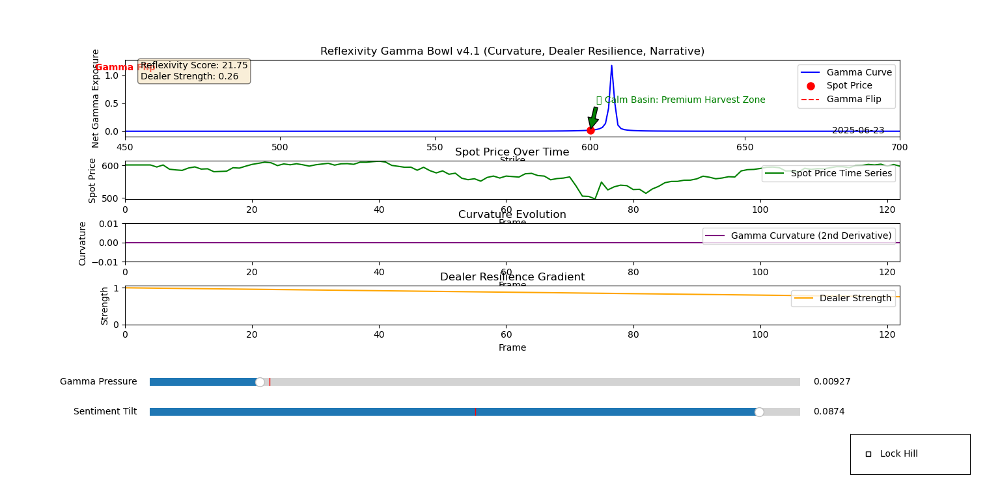
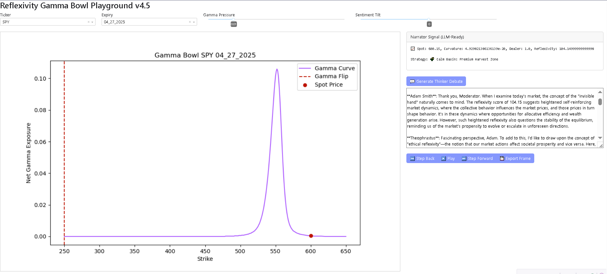

# Reflexivity Gamma Bowl Suite

Collection of option modeling visualizations that utilize Gamma monitoring as a baseline monitor, customizable



<details><summary>Milestone Update 6.24.2025 - 🧠 🤔 Reflexivity LLM Integration </summary>

A Dash App that can be run with ```python  reflexivity_dash.py``` after ```manifest_utils.py``` has been run *after* ```reflexivity_gamma_bowlv44.py``` allows for a powerful dynamic:

- Add an OpenAI key with a .env file
- Deploy Dashboard App
- Click "Generate Thinker Debate"



  
</details>

## Overview
This directory contains the evolving suite of Reflexivity Gamma Bowl scripts, each representing a milestone in the simulation, visualization, and analysis of option market reflexivity. The project is designed for researchers, quants, and AI agents interested in gamma dynamics, dealer behavior, and narrative analytics.

## Table of Contents
- [v1: Baseline CLI](#v1-baseline-cli)
- [v2: Enhanced Analytics](#v2-enhanced-analytics)
- [v3: Real-Time Option Data](#v3-real-time-option-data)
- [v4: Interactive UI, Dealer Logic](#v4-interactive-ui-dealer-logic)
- [v4.1: Multi-Subplot, Dealer Resilience](#v41-multi-subplot-dealer-resilience)
- [v4.2: Robust Expiry/Strike, Combined UI](#v42-robust-expirystrike-combined-ui)
- [v4.3: Full Time-Series Sync, Advanced Analytics](#v43-full-time-series-sync-advanced-analytics)
- [v4.4: Automated Backtesting & Foresight](#v44-automated-backtesting--foresight)

---

## v1: Baseline CLI
- Simple gamma bowl simulation with spot price and synthetic gamma curve.
- No option chain, expiry selection, or interactive UI.
- CLI for running basic reflexivity and trade signal simulation.

## v2: Enhanced Analytics
- Enhanced gamma bowl with instability/stability zone overlays and curvature tracking.
- Narrative strategy signals (coiled volatility, calm basin).
- Trade log and markdown/HTML report export.
- No interactive UI or expiry/strike selection.

## v3: Real-Time Option Data
- Synchronized animation with real historical stock and option chain data.
- Gamma bowl generated from actual option chain (nearest expiry).
- Time-aware playback and basic narrative overlays.
- Markdown export of strategy signals and PNG chart export.

## v4: Interactive UI, Dealer Logic
- Interactive matplotlib UI: sliders for gamma pressure, sentiment tilt, lock hill checkbox.
- Synchronized subplots for gamma curve and spot price time series.
- Dealer strength and lock hill logic for dynamic reflexivity modeling.
- Instability zone overlays and narrative strategy signals.

## v4.1: Multi-Subplot, Dealer Resilience
- Multi-subplot analytics: gamma, spot, curvature, dealer strength gradient.
- Expanded narrative overlays and dealer resilience gradient.
- Markdown export of strategy signals and PNG chart export.

## v4.2: Robust Expiry/Strike, Combined UI
- Robust parsing and handling of Expiration Date and strike selection.
- Combined net gamma and dealer strength in one plot.
- Interactive controls for expiry and strike.
- Curvature tracker subplot and markdown export.

## v4.3: Full Time-Series Sync, Advanced Analytics
- All subplots synchronized to the same time axis (true time-series view).
- Spot price chart is a real time series.
- Curvature sensitivity further amplified.
- Most advanced and interactive version for research and presentation.

## v4.4: Automated Backtesting & Foresight
- Automated batch processing over a date range.
- Generates gamma bowl charts, markdown strategy signals, and JSON metrics for each trading day.
- Organizes outputs by date for research and future LLM narration.
- CLI supports custom date ranges and output directories.
- Lays groundwork for future Dash app and LLM-driven narration modules.

---

For more details, see the docstring at the top of each script or the progress.log for a full changelog. 

<details>
<summary>🍻 A Tavern at the Edge of Time – Dialogue Between Adam Smith and Theophrastus</summary>

Adam Smith (raising his tankard):

“In my time, markets were but fields of wheat and wool. Now I see your ‘gamma bowls’—these curvature waves and reflexive pressures. The invisible hand? A dealer now, hedging with precision.”

Theophrastus (smiling, sketching a parabola on a napkin):

“Markets today are living organisms, Adam. Your hand remains, but now it trembles with feedback—sentiment, narrative, central banks whispering in IV slopes. We've merely decoded its tremors.”

Smith (leaning forward):

“Tell me, this dealer strength—he sounds a lot like my butcher and baker, motivated by need, not foresight. But you model him with slope and curvature?”

Theophrastus:

“Exactly! And yet, their aggregate motion builds bowls—reflexive vessels. One tilt, and the marble runs. It's no longer just price we trade… it's anticipation.”

Smith (chuckling):

“And here I thought supply and demand was subtle! You lot are conjuring narrative overlays and calling them ‘calm basins’ and ‘harvest zones.’ You’ve turned economic gravity into art.”

Theophrastus (raising a toast):

“To the new philosophers—not of ethics or metaphysics—but of implied volatility and emergent strategy. May your reflexive scrolls always anticipate the flip!”

Smith:

“Aye. And may the marble never roll off the edge unnoticed.”

  
</details>


